# Jenkins CI Assignment – CI Checks for Python, Go & Java

## Table of Contents

1. [Assignment Overview](#1-assignment-overview)
2. [Objectives](#2-objectives)
3. [Repositories](#3-repositories)
4. [Jenkins Job Structure](#4-jenkins-job-structure)
   - [Python – attendance-api](#41-python--attendance-api)
   - [Go – employee-api](#42-go--employee-api)
   - [Java – spring3hibernate](#43-java--spring3hibernate)
5. [CI Checks Performed](#5-ci-checks-performed)
6. [Reports and Artifacts](#6-reports-and-artifacts)
7. [Notifications](#7-notifications)
8. [Tools Used](#8-tools-used)
9. [Overall Workflow](#9-overall-workflow)
10. [Conclusion](#10-conclusion)

---

# 1. Assignment Overview

The objective of this assignment is to create Jenkins CI jobs for three different application repositories:

- Python
- GoLang
- Java

For each repository, four separate Jenkins Freestyle jobs are created to perform common Continuous Integration checks:

1. Credential / Secret Scanning
2. Unit Testing
3. Code Coverage
4. Dependency Scanning

The Jenkins jobs clone the source code from GitHub, execute the required CI checks, generate reports, and store the generated reports as Jenkins build artifacts.

Failure notifications are also configured through Email and Slack.

---

# 2. Objectives

The main objectives of this assignment are:

- Understand Jenkins Freestyle jobs.
- Integrate Jenkins with GitHub repositories.
- Perform credential scanning using Gitleaks.
- Execute unit tests.
- Generate and publish code coverage reports.
- Scan application dependencies for known vulnerabilities.
- Archive reports and other generated artifacts in Jenkins.
- Configure Email and Slack notifications for failed builds.
- Create a consistent CI structure for different programming languages.

---

# 3. Repositories

| Language | Repository | Repository URL |
|---|---|---|
| Python | attendance-api | https://github.com/OT-MICROSERVICES/attendance-api |
| GoLang | employee-api | https://github.com/OT-MICROSERVICES/employee-api |
| Java | spring3hibernate | https://github.com/rahul96saini/spring3hibernate.git |

---

# 4. Jenkins Job Structure

A total of **12 Jenkins Freestyle jobs** were created.

Each repository has four CI jobs.

## 4.1 Python – attendance-api

Repository:

```text
https://github.com/OT-MICROSERVICES/attendance-api
```

The Jenkins view contains the following four jobs:

| # | Jenkins Job | CI Check |
|---|---|---|
| 1 | `attendance-api-secret-scan` | Credential / Secret Scan |
| 2 | `attendance-api-unit-test` | Unit Testing |
| 3 | `attendance-api-code-coverage` | Code Coverage |
| 4 | `attendance-api-dependency-check` | Dependency Scan |

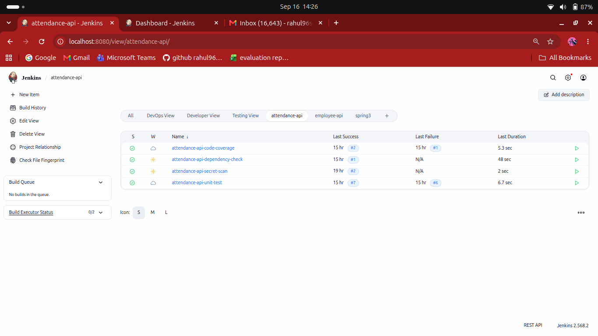

### `attendance-api-secret-scan`

This job performs credential scanning on the Python source code using **Gitleaks**.

Generated report:

```text
reports/gitleaks.json
```

The report is archived in Jenkins as a build artifact.

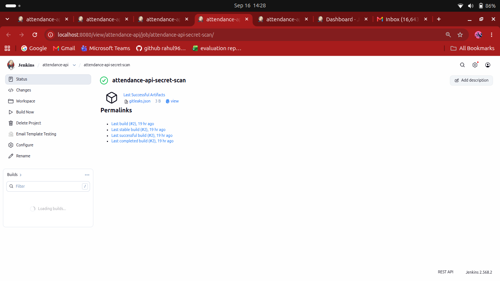

### `attendance-api-unit-test`

This job executes the Python unit tests using `pytest`.

Tests that required external PostgreSQL and Redis services were excluded because those services were not configured as part of this Jenkins assignment.

The job generates an HTML test report.

Generated report:

```text
reports/pytest-report.html
```

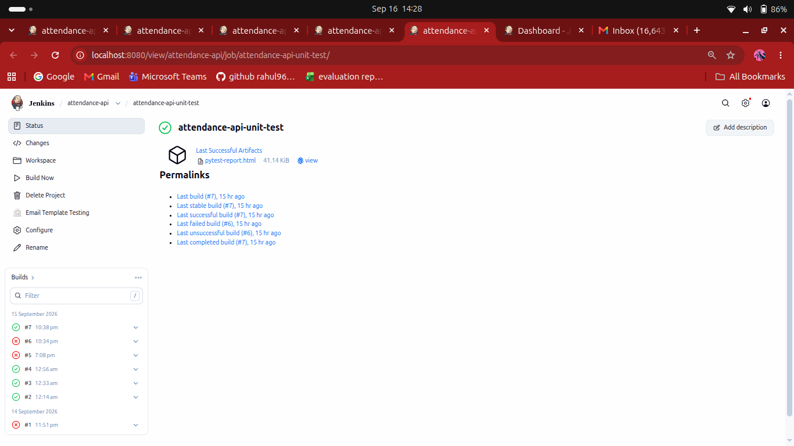

### `attendance-api-code-coverage`

This job executes the Python tests with `pytest-cov` and generates a coverage report.

Generated coverage report:

```text
reports/coverage/
```

The coverage report is published as an HTML report in Jenkins.

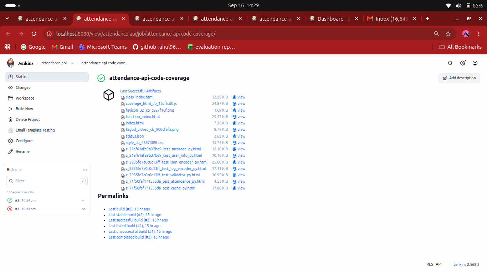

### `attendance-api-dependency-check`

This job performs a dependency vulnerability scan for the Python project.

The generated dependency scan report is stored and archived in Jenkins.

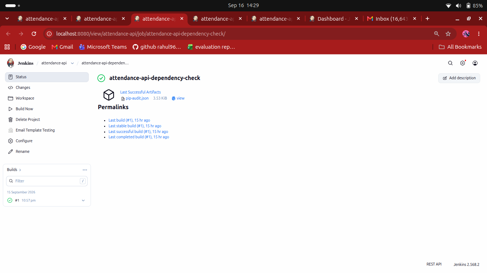

---

## 4.2 Go – employee-api

Repository:

```text
https://github.com/OT-MICROSERVICES/employee-api
```

The Jenkins view contains the following four jobs:

| # | Jenkins Job | CI Check |
|---|---|---|
| 1 | `employee-api-secret-scan` | Credential / Secret Scan |
| 2 | `employee-api-unit-test` | Unit Testing |
| 3 | `employee-api-code-coverage` | Code Coverage |
| 4 | `employee-api-dependency-check` | Dependency Scan |

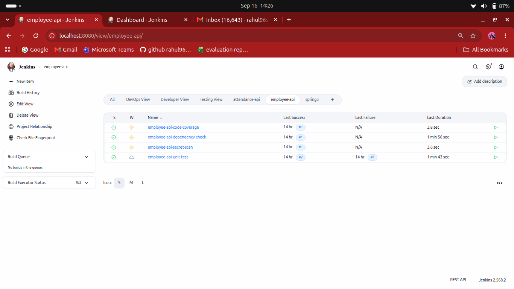

### `employee-api-secret-scan`

This job performs credential scanning using **Gitleaks**.

Generated report:

```text
reports/gitleaks.json
```

The report is archived in Jenkins.

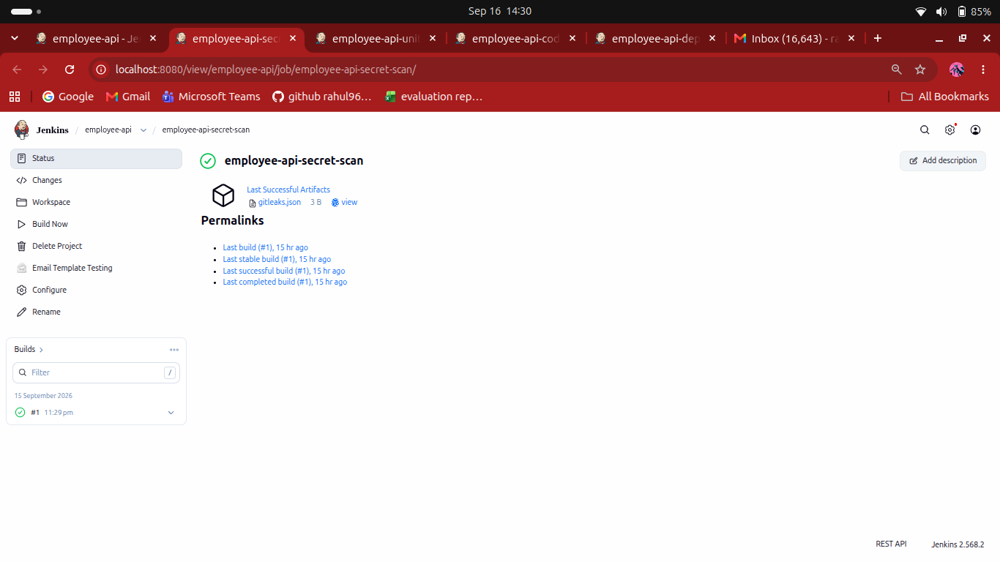

### `employee-api-unit-test`

This job runs the Go unit tests using:

```bash
go test ./...
```

The test output is converted into a JUnit-compatible XML report.

Generated reports:

```text
reports/test-output.txt
reports/go-test-report.xml
```

The JUnit report can be published through Jenkins' JUnit test result publisher.

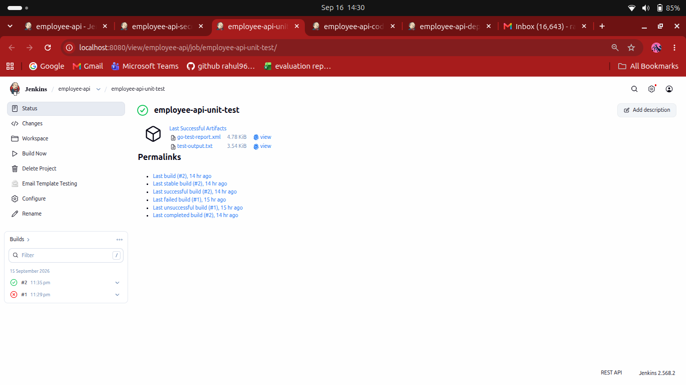

### `employee-api-code-coverage`

This job executes Go tests with coverage enabled.

Coverage is generated using:

```bash
go test ./... -coverprofile=reports/coverage.out
```

An HTML report is then generated using:

```bash
go tool cover
```

Generated reports:

```text
reports/coverage.out
reports/coverage.html
```
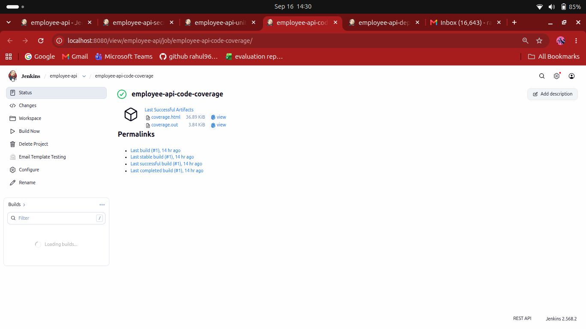

### `employee-api-dependency-check`

This job scans Go dependencies for known vulnerabilities using **govulncheck**.

Generated report:

```text
reports/govulncheck.txt
```

The report is archived in Jenkins.

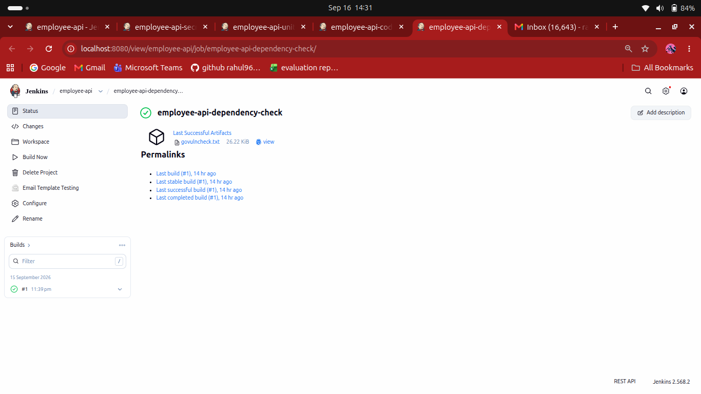

---

## 4.3 Java – spring3hibernate

Repository:

```text
https://github.com/rahul96saini/spring3hibernate.git
```

The Jenkins view contains the following four jobs:

| # | Jenkins Job | CI Check |
|---|---|---|
| 1 | `spring3-secret-scan` | Credential / Secret Scan |
| 2 | `spring3-unit-test` | Unit Testing |
| 3 | `spring3-code-coverage` | Code Coverage |
| 4 | `spring3-dependency-check` | Dependency Scan |

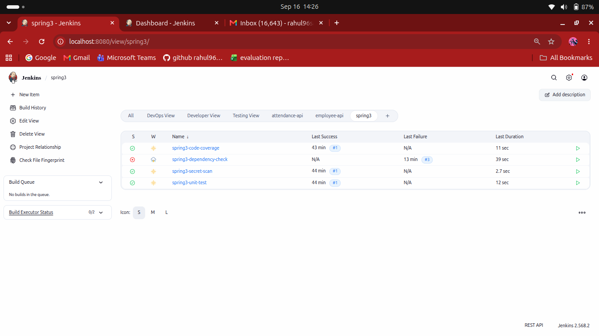

### `spring3-secret-scan`

This job performs credential scanning using **Gitleaks**.

Generated report:

```text
reports/gitleaks.json
```

The report is archived in Jenkins.

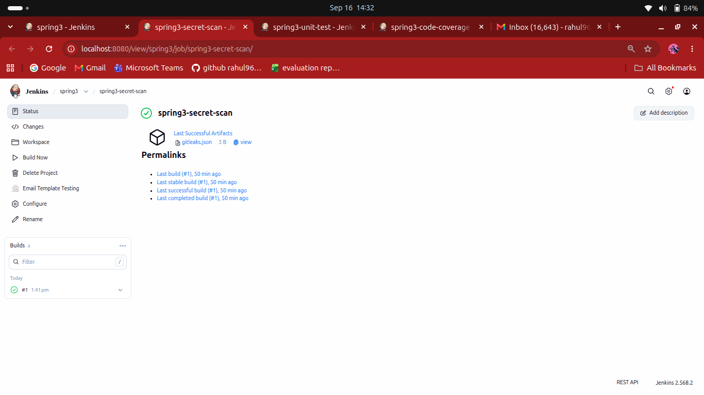

### `spring3-unit-test`

This job executes the Maven unit tests using:

```bash
mvn test
```

Maven Surefire generates the test reports.

The reports are copied into:

```text
reports/
```

The XML reports are published through Jenkins' JUnit test result publisher.

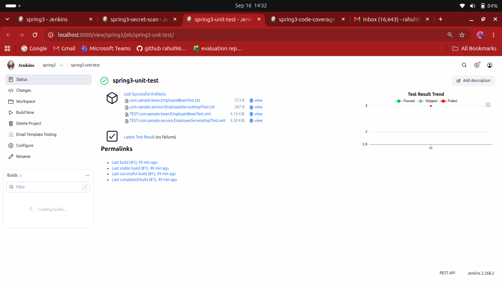

### `spring3-code-coverage`

This job uses **Maven JaCoCo** for code coverage.

The JaCoCo configuration is handled through the project's `pom.xml`.

The Jenkins job executes:

```bash
mvn clean test
```

The generated JaCoCo HTML report is copied to:

```text
reports/
```

The report is published as an HTML report in Jenkins.

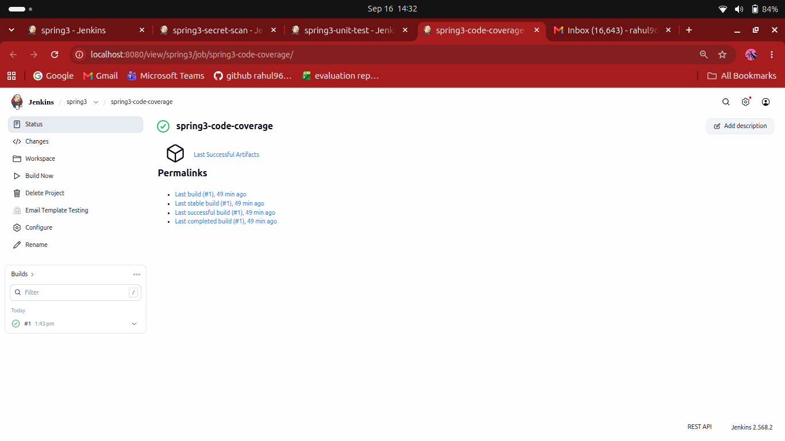

### `spring3-dependency-check`

This job performs dependency vulnerability scanning using **OWASP Dependency-Check**.

The Dependency-Check CLI is installed on the Jenkins machine and is executed from:

```text
/opt/dependency-check/dependency-check/bin/dependency-check.sh
```

The scan uses an NVD API key stored securely in Jenkins credentials.

The generated HTML report is stored in:

```text
reports/
```

The main report is:

```text
dependency-check-report.html
```

The report is archived and published as an HTML report in Jenkins.

---

# 5. CI Checks Performed

## 5.1 Credential / Secret Scanning

**Tool:** Gitleaks

Purpose:

- Detect hard-coded passwords.
- Detect API keys.
- Detect tokens.
- Detect other sensitive credentials committed to source code.

Example command:

```bash
gitleaks detect \
  --source . \
  --report-format json \
  --report-path reports/gitleaks.json
```

---

## 5.2 Unit Testing

Unit testing validates the application's functionality through automated tests.

### Python

```bash
pytest
```

### Go

```bash
go test ./...
```

### Java

```bash
mvn test
```

Test reports are stored and/or published through Jenkins.

---

## 5.3 Code Coverage

Code coverage shows how much of the application's code is executed by the automated tests.

### Python

Uses `pytest-cov`.

Example:

```bash
pytest --cov=. --cov-report=html:reports/coverage
```

### Go

Uses the built-in Go coverage functionality:

```bash
go test ./... -coverprofile=reports/coverage.out
go tool cover \
  -html=reports/coverage.out \
  -o reports/coverage.html
```

### Java

Uses **JaCoCo** through Maven.

```bash
mvn clean test
```

The JaCoCo plugin generates the HTML coverage report.

---

## 5.4 Dependency Scanning

Dependency scanning checks project dependencies for known security vulnerabilities.

### Python

The Python project's dependencies are scanned using the configured dependency scanning tool.

### Go

Uses:

```text
govulncheck
```

Example:

```bash
govulncheck ./...
```

### Java

Uses:

```text
OWASP Dependency-Check
```

The Java dependency scan uses the NVD database to identify known vulnerabilities.

An NVD API key is stored as a Jenkins credential instead of being hard-coded in the build script.

---

# 6. Reports and Artifacts

Reports generated during the builds are stored in Jenkins using **Archive the artifacts**.

Examples include:

```text
reports/gitleaks.json
reports/pytest-report.html
reports/coverage/
reports/go-test-report.xml
reports/coverage.html
reports/govulncheck.txt
reports/dependency-check-report.html
```

This allows the generated reports to remain accessible from the Jenkins build page after the build completes.

HTML reports are also published using the Jenkins HTML Publisher configuration where applicable.

JUnit-compatible reports are published using Jenkins' JUnit test result publisher.

---

# 7. Notifications

Email and Slack notifications are configured in Jenkins using **Post-build Actions**.

The notification configuration is intended to notify the user when a CI job fails.

The configured notification flow is:

```text
Jenkins Job
     |
     v
CI Check
     |
     +---- SUCCESS ---> Build Successful
     |
     +---- FAILURE ---> Email Notification
                         +
                         Slack Notification
```

Example Jenkins failure notification events include:

```text
Failure - Any
```

This provides immediate visibility when a CI check fails.

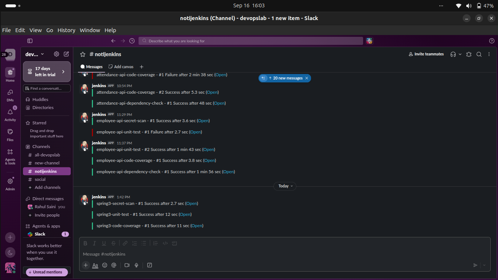
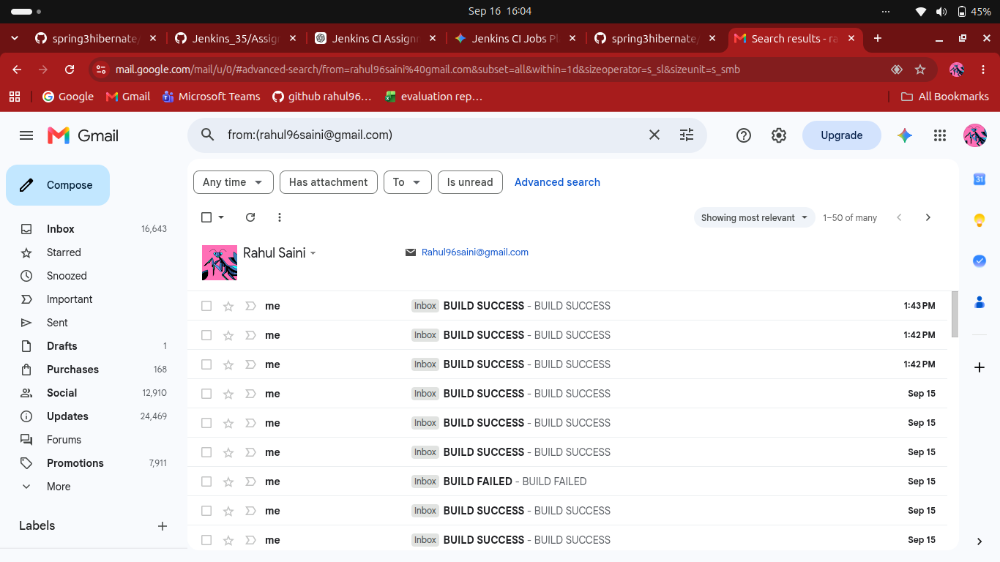
---

# 8. Tools Used

| Tool | Purpose |
|---|---|
| Jenkins | CI automation |
| Git / GitHub | Source code management |
| Gitleaks | Credential / secret scanning |
| Pytest | Python unit testing |
| pytest-cov | Python code coverage |
| Go Test | Go unit testing and coverage |
| go-junit-report | Go JUnit test report generation |
| govulncheck | Go dependency vulnerability scanning |
| Maven | Java build and testing |
| JaCoCo | Java code coverage |
| OWASP Dependency-Check | Java dependency vulnerability scanning |
| NVD | Vulnerability database used by Dependency-Check |
| Email | Jenkins failure notifications |
| Slack | Jenkins failure notifications |

---

# 9. Overall Workflow

The overall CI structure created in this assignment is:

```text
                         GitHub Repositories
                                |
              +-----------------+-----------------+
              |                 |                 |
              v                 v                 v
        Python API          Go API             Java App
       attendance-api      employee-api       spring3hibernate
              |                 |                 |
              +-----------------+-----------------+
                                |
                         Jenkins Freestyle Jobs
                                |
             +------------------+------------------+
             |                  |                  |
             v                  v                  v
       Secret Scan         Unit Test        Code Coverage
       (Gitleaks)          (Tests)          (Coverage)
             |                  |                  |
             +------------------+------------------+
                                |
                                v
                      Dependency Scanning
                                |
                                v
                         Reports / Artifacts
                                |
                                v
                       Jenkins Build History
                                |
                       +--------+--------+
                       |                 |
                       v                 v
                    Email             Slack
                  Notification      Notification
```

### Jobs Summary

```text
Python
├── attendance-api-secret-scan
├── attendance-api-unit-test
├── attendance-api-code-coverage
└── attendance-api-dependency-check

GoLang
├── employee-api-secret-scan
├── employee-api-unit-test
├── employee-api-code-coverage
└── employee-api-dependency-check

Java
├── spring3-secret-scan
├── spring3-unit-test
├── spring3-code-coverage
└── spring3-dependency-check
```

---

# 10. Conclusion

This assignment demonstrates a basic multi-language CI implementation using Jenkins Freestyle jobs.

For each of the three repositories, four independent CI checks were configured:

- Credential / Secret Scanning
- Unit Testing
- Code Coverage
- Dependency Scanning

The generated reports are stored as Jenkins artifacts, relevant reports are published in Jenkins, and build failures can trigger Email and Slack notifications.

This setup provides a common CI structure that can be applied to applications written in different programming languages.