# Assignment 5 — Scripted CI Pipeline for Java Project

## Table of Contents
1. Assignment Objective
2. Project Used
3. Pipeline Flow
4. Pipeline Stages
5. Build Parameters
6. Approval and Artifact Publication
7. Reports
8. Notifications
9. Expected Result
10. POM Configuration and Changes

## Assignment Objective

Create a Scripted CI Pipeline for a Java-based project containing:

- Code checkout
- Parallel code stability, quality, and coverage scans
- Code quality and coverage reports
- Artifact publication
- Slack and Email notifications
- Options to skip individual scans
- Approval before artifact publication
- Publication only when approved
- Success/failure notifications

## Project Used

**GitHub Repository:** `https://github.com/rahul96saini/spring3hibernate.git`

**Branch:** `master`

**Project:** Java / Maven / WAR

## Pipeline Flow

```text
Code Checkout
      |
      v
Parallel Scans
  +---+-----------+---+
  |   |           |   |
  v   v           v   |
Test Checkstyle JaCoCo
  +---+-----------+---+
      |
      v
   Package
      |
      v
  Approval
   /     \
  /       \
Deny     Approve
           |
           v
    Publish Artifact
           |
           v
     Slack + Email
```
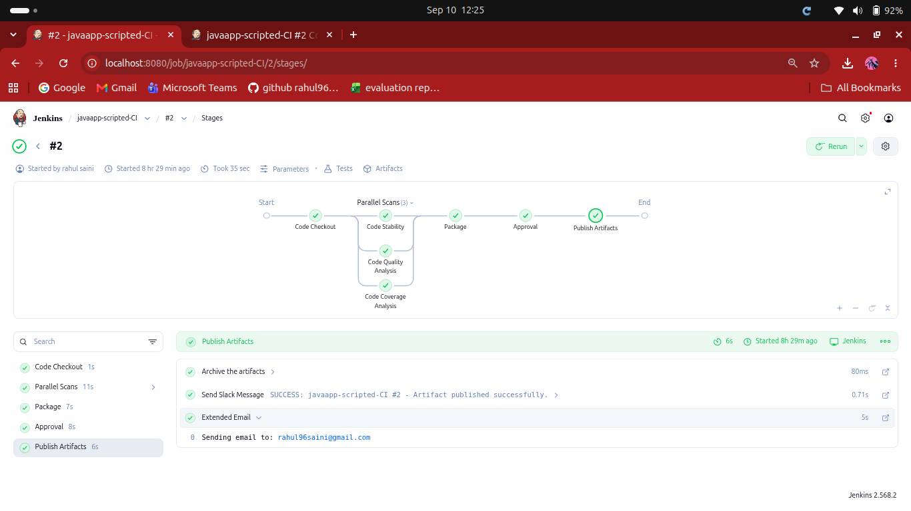

## Pipeline Stages

### 1. Code Checkout

Checks out the `master` branch from GitHub.

```groovy
git branch: 'master',
    url: 'https://github.com/rahul96saini/spring3hibernate.git'
```

### 2. Parallel Scans

#### Code Stability

Runs unit tests and publishes JUnit results.

```groovy
sh 'mvn test'
junit 'target/surefire-reports/*.xml'
```

#### Code Quality Analysis

Runs Checkstyle and archives the generated XML report.

```groovy
sh 'mvn checkstyle:checkstyle'

archiveArtifacts(
    artifacts: 'target/checkstyle-result.xml',
    fingerprint: true
)
```

The legacy project produces Checkstyle violations, but the existing Maven configuration does not fail the build because of them.

#### Code Coverage Analysis

Generates and publishes JaCoCo coverage information.

```groovy
sh 'mvn jacoco:report'

jacoco(
    execPattern: 'target/jacoco.exec'
)
```

### 3. Package

Packages the application as a WAR file.

```groovy
sh 'mvn package -DskipTests'
```

The WAR is generated under `target/`.

### 4. Approval

Before publishing, Jenkins asks the user to select:

```text
Approve
Deny
```

Only an approved build continues to artifact publication.

### 5. Publish Artifacts

When approved, the WAR is archived:

```groovy
archiveArtifacts(
    artifacts: 'target/*.war',
    fingerprint: true
)
```
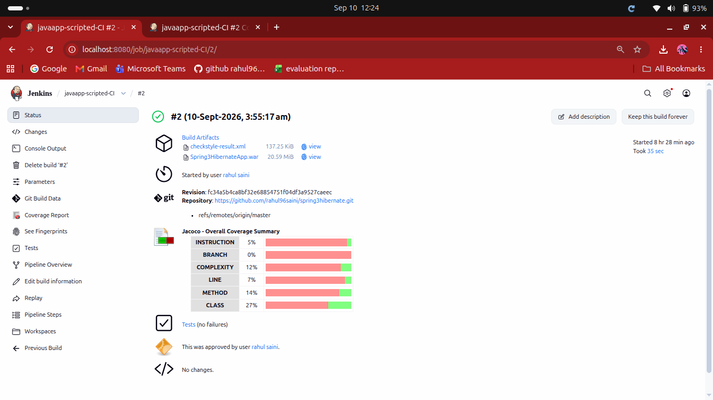


### 6. Notifications

Successful publication sends Slack and Email notifications.

If publication fails, failure notifications are sent through Slack and Email and the build is marked failed.

## Build Parameters

The pipeline provides three Boolean parameters:

| Parameter | Purpose | Default |
|---|---|---|
| `RUN_CODE_STABILITY` | Run stability tests | `true` |
| `RUN_CODE_QUALITY` | Run Checkstyle | `true` |
| `RUN_CODE_COVERAGE` | Run JaCoCo | `true` |

Parameters are defined in a Scripted Pipeline using:

```groovy
properties([
    parameters([
        ...
    ])
])
```

They are accessed using:

```groovy
params.RUN_CODE_STABILITY
params.RUN_CODE_QUALITY
params.RUN_CODE_COVERAGE
```

This allows the user to skip individual scans during a build.

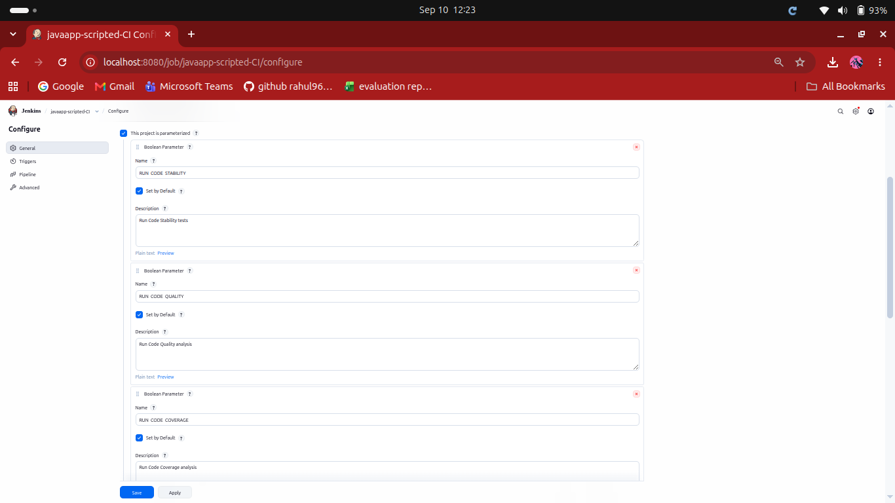
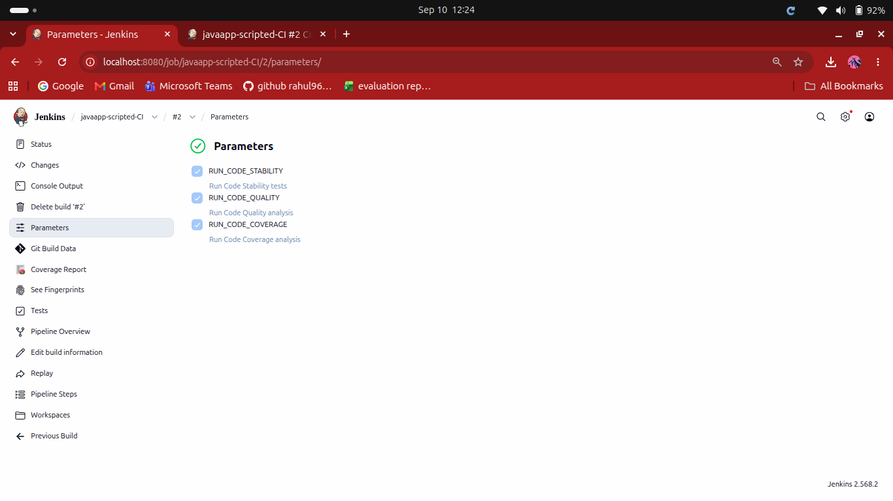

## Approval and Artifact Publication

The publication state is stored in:

```groovy
def publicationApproved = false
```

The approval is collected using the Jenkins `input` step.

If `Approve` is selected:

```groovy
publicationApproved = true
```

If `Deny` is selected:

```groovy
publicationApproved = false
```

The WAR is published only when `publicationApproved` is true.

## Reports

| Report | Tool | Jenkins Result |
|---|---|---|
| Unit Test Report | JUnit | Test results |
| Code Quality Report | Checkstyle | Archived XML |
| Code Coverage Report | JaCoCo | Coverage report |
| Build Artifact | Maven WAR | Archived WAR |

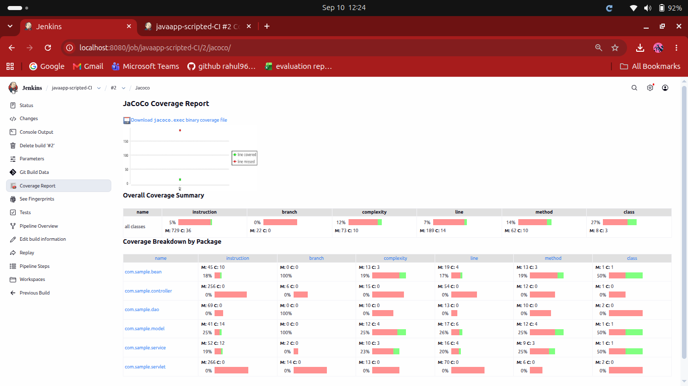
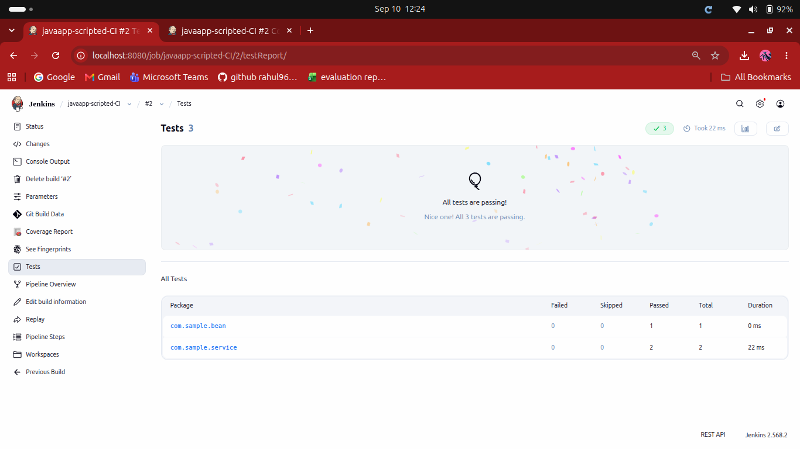

## Notifications

### Successful Publication

Slack and Email notifications are sent after successful artifact publication.

### Failed Publication

If artifact publication fails, Slack and Email failure notifications are sent and the original error is rethrown so Jenkins marks the build as failed.

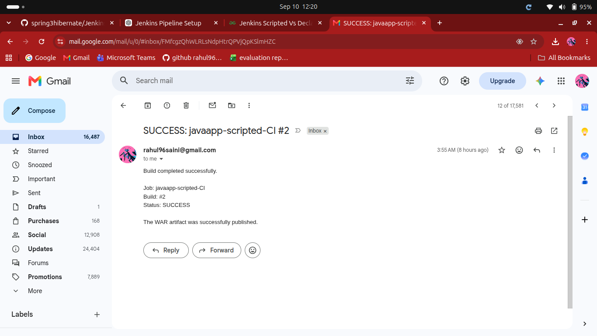
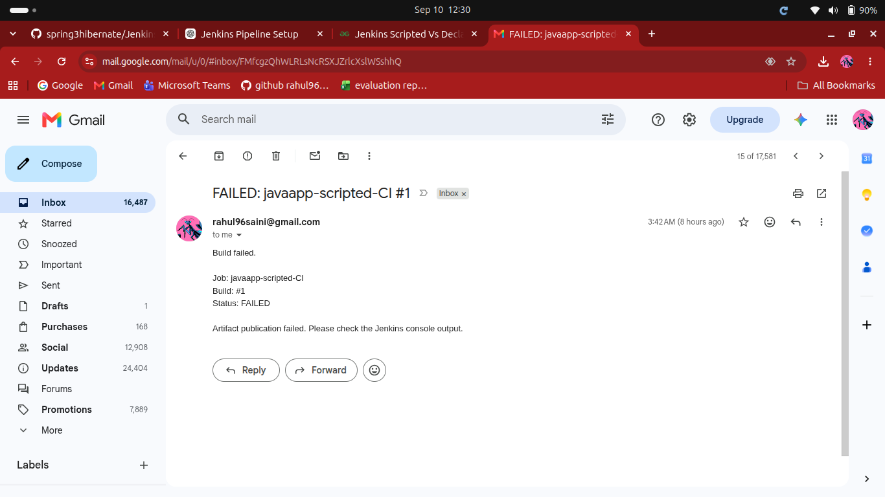
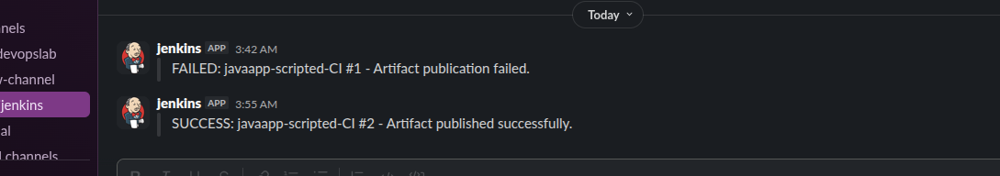

## Expected Result

### Approved Build

```text
Code Checkout          SUCCESS
Parallel Scans         SUCCESS
  ├── Code Stability   SUCCESS
  ├── Code Quality     SUCCESS
  └── Code Coverage    SUCCESS
Package                SUCCESS
Approval               APPROVE
Publish Artifacts      SUCCESS
Slack + Email          SENT
```

The build should contain the JUnit results, JaCoCo coverage report, Checkstyle XML report, and WAR artifact.

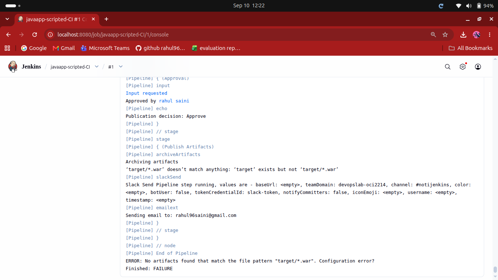
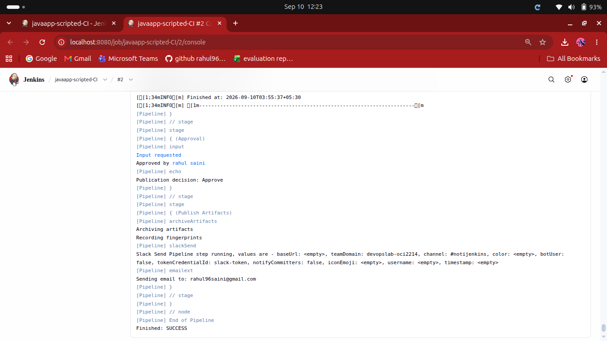

### Denied Build

```text
Approval               DENY
Publish Artifacts      SKIPPED
```

The WAR is not published when publication is denied.                

# 11. POM Configuration and Changes

The project is a legacy Java application, so some Maven plugin configurations were updated to work correctly with the modern Jenkins environment.

##  Java Compiler Configuration

Configured Maven to compile the legacy project using **Java 8 source/target compatibility**:

```xml
<properties>
    <maven.compiler.source>1.8</maven.compiler.source>
    <maven.compiler.target>1.8</maven.compiler.target>
</properties>
```

The Jenkins machine uses **JDK 21**, while the project is compiled with **Java 8 compatibility**.

This allows the older Java project to be compiled in the modern JDK environment without changing the application's source compatibility level.

---

## Maven Compiler Plugin

Updated/configured the Maven Compiler Plugin:

```xml
<plugin>
    <groupId>org.apache.maven.plugins</groupId>
    <artifactId>maven-compiler-plugin</artifactId>
    <version>3.11.0</version>
    <configuration>
        <source>1.8</source>
        <target>1.8</target>
    </configuration>
</plugin>
```

### Purpose

The compiler plugin ensures that the Java source code is compiled using Java 8 source and target compatibility while Jenkins itself runs on JDK 21.

---

## JaCoCo Code Coverage

Configured JaCoCo for code coverage analysis.

```text
JaCoCo Maven Plugin: 0.8.8
```

The pipeline generates:

```text
target/jacoco.exec
target/site/jacoco/
```

Jenkins then publishes the coverage using the JaCoCo Jenkins plugin.

### Maven Command

```bash
mvn jacoco:report
```

### Purpose

JaCoCo measures how much of the application's code is executed by the unit tests.

---

## Checkstyle Code Quality

Configured Checkstyle for static code-quality analysis.

```text
Checkstyle Maven Plugin: 2.14
```

The generated report is:

```text
target/checkstyle-result.xml
```

### Maven Command

```bash
mvn checkstyle:checkstyle
```

The existing project has many Checkstyle violations:

```text
813 reported violations
```

However, the build is not failed because:

```text
failOnViolation=false
```

is configured.

This allows the pipeline to generate and publish the Checkstyle report without stopping the complete CI pipeline because of existing code-quality violations.

---

## Maven WAR Plugin

The original legacy WAR plugin caused compatibility problems with the modern Java environment.

It was updated to:

```xml
<plugin>
    <groupId>org.apache.maven.plugins</groupId>
    <artifactId>maven-war-plugin</artifactId>
    <version>3.4.0</version>
</plugin>
```

### Purpose

The updated WAR plugin allows the project to successfully create the WAR artifact under the modern JDK/Maven environment.

The generated artifact is:

```text
target/*.war
```

---

## Unit Testing

Unit tests are executed using:

```bash
mvn test
```

Maven Surefire generates the test results under:

```text
target/surefire-reports/
```

Jenkins publishes these results using:

```groovy
junit 'target/surefire-reports/*.xml'
```

### Purpose

JUnit/Surefire results allow Jenkins to display:

- Total tests
- Passed tests
- Failed tests
- Skipped tests
- Test history

---
