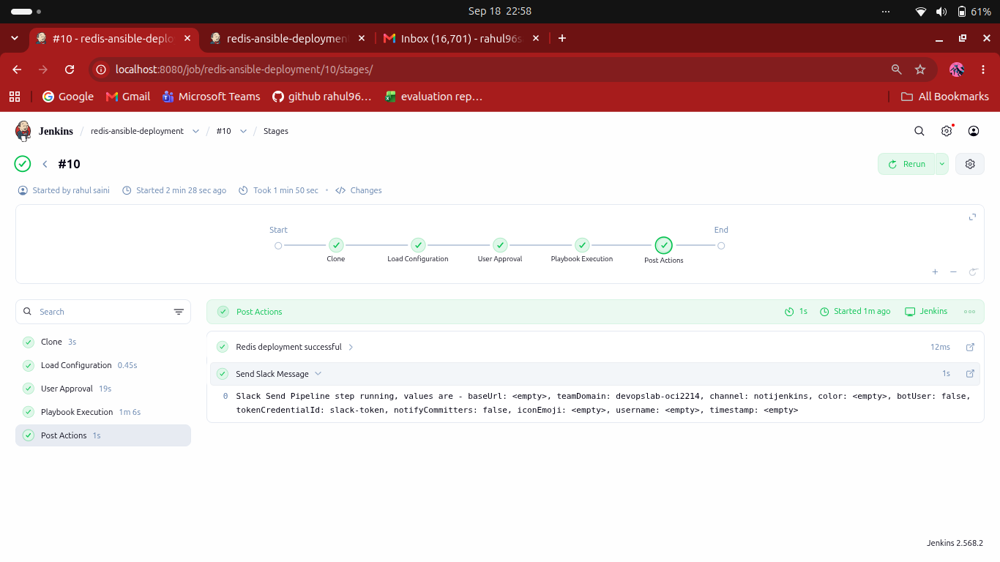
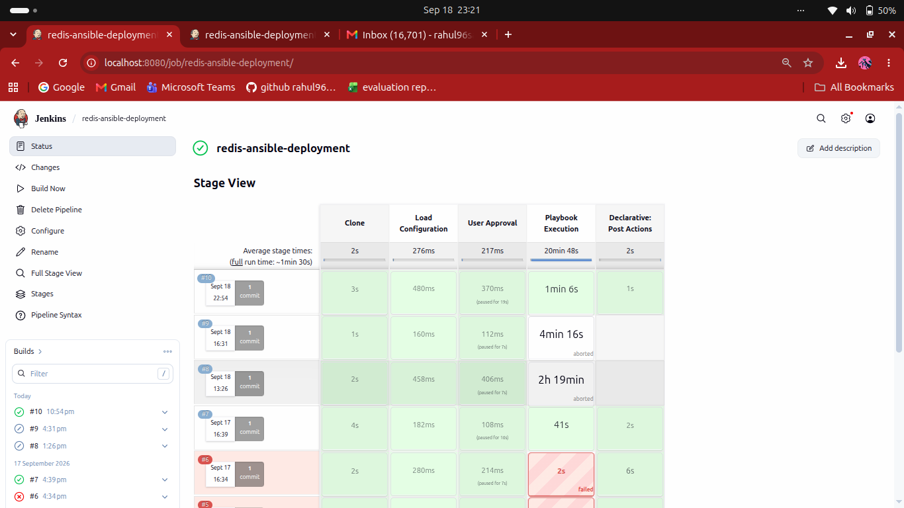
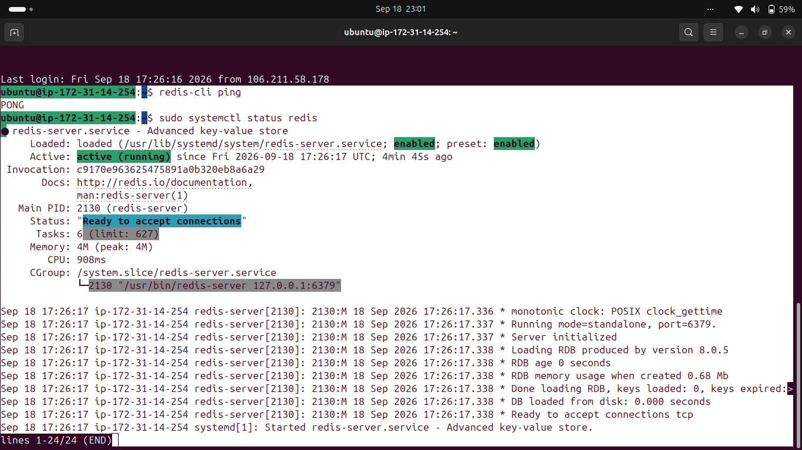
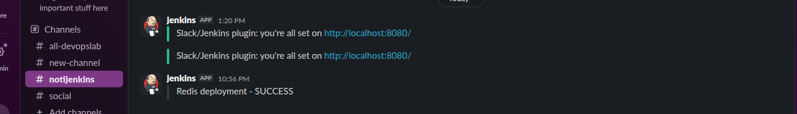

# Assignment 6 — Ansible Shared Library with Jenkins

## Table of Contents

1. [Assignment Overview](#1-assignment-overview)
2. [Objective](#2-objective)
3. [Architecture](#3-architecture)
4. [Repository Structure](#4-repository-structure)
5. [Technologies Used](#5-technologies-used)
6. [Ansible Demo Project](#6-ansible-demo-project)
7. [Ansible Redis Role](#7-ansible-redis-role)
8. [Configuration File](#8-configuration-file)
9. [Jenkins Shared Library](#9-jenkins-shared-library)
10. [Jenkinsfile](#10-jenkinsfile)
11. [Jenkins Job Configuration](#11-jenkins-job-configuration)
12. [Pipeline Stages](#12-pipeline-stages)
13. [SSH Credential Configuration](#13-ssh-credential-configuration)
14. [Redis Deployment](#14-redis-deployment)
15. [Redis Verification](#15-redis-verification)
16. [Slack Notification](#16-slack-notification)
17. [Troubleshooting](#17-troubleshooting)
18. [Final Result](#18-final-result)

---

# 1. Assignment Overview

The objective of this assignment is to create an **Ansible Shared Library in Jenkins** that can be reused to deploy a tool to an AWS EC2 server.

For this assignment, **Redis** is used as the tool and an **Ubuntu EC2 instance** is used as the target server.

The shared library implements the following workflow:

```text
Clone
   ↓
Load Configuration
   ↓
User Approval
   ↓
Playbook Execution
   ↓
Notification
```

The required inputs for the shared library are provided through a configuration file.


---

# 2. Objective

The assignment requirements are:

- Create an Ansible Shared Library in Jenkins.
- Clone the Ansible project.
- Load deployment configuration from a configuration file.
- Provide a user approval stage before deployment.
- Execute the Ansible playbook.
- Deploy Redis on an Ubuntu EC2 instance.
- Send a Slack notification after the deployment.
- Keep the deployment configuration separate from the shared library logic.

The shared library is designed so that deployment-specific values can be changed through the configuration file.

---

# 3. Architecture

The overall architecture used in this assignment is:

```text
                         GitHub
                           |
                           |
             +-------------+-------------+
             |                           |
             v                           v
     ansible-demo-project       ansible-shared-library
             |                           |
             +-------------+-------------+
                           |
                           v
                        Jenkins
                           |
                           v
                 Load Configuration
                           |
                           v
                    User Approval
                           |
                           v
                  Ansible Playbook
                           |
                           v
                    AWS EC2 Ubuntu
                           |
                           v
                         Redis
                           |
                           v
                   Slack Notification
```

### Deployment Flow

```text
GitHub
  |
  v
Jenkins
  |
  +--> Clone
  |
  +--> Load Configuration
  |
  +--> User Approval
  |
  +--> Ansible Playbook
  |
  +--> Ubuntu EC2
  |       |
  |       +--> Install Redis
  |       +--> Configure Redis
  |       +--> Start Redis
  |       +--> Verify Redis
  |
  +--> Slack Notification
```

---

# 4. Repository Structure

The assignment is maintained inside the existing GitHub repository:

```text
local-jenkins/
│
├── Assignment-1/
├── Assignment-2/
├── Assignment-3/
├── Assignment-4/
├── Assignment-5/
│
└── Assignment-6/
    │
    ├── ansible-demo-project/
    │   ├── ansible.cfg
    │   ├── inventory
    │   ├── playbook.yml
    │   ├── Jenkinsfile
    │   │
    │   ├── config/
    │   │   └── prod.conf
    │   │
    │   └── redis-config/
    │       ├── defaults/
    │       │   └── main.yml
    │       ├── handlers/
    │       │   └── main.yml
    │       ├── meta/
    │       │   └── main.yml
    │       ├── tasks/
    │       │   ├── main.yml
    │       │   └── ubuntu.yml
    │       ├── templates/
    │       │   └── redis.conf.j2
    │       ├── tests/
    │       │   ├── inventory
    │       │   └── test.yml
    │       └── vars/
    │           ├── Debian.yml
    │           └── main.yml
    │
    └── ansible-shared-library/
        └── vars/
            └── redisDeployment.groovy
```

---

# 5. Technologies Used

The following technologies and tools were used:

- Jenkins
- Jenkins Shared Library
- Ansible
- Redis
- AWS EC2
- Ubuntu
- Git
- GitHub
- SSH
- Slack
- Groovy
- Python virtual environment for local Ansible setup

---

# 6. Ansible Demo Project

The `ansible-demo-project` contains the Redis Ansible implementation.

### `ansible.cfg`

The Ansible configuration contains:

```ini
[defaults]
inventory = inventory
host_key_checking = False
interpreter_python = auto_silent
```

This configuration:

- Uses the local `inventory` file.
- Disables SSH host key checking for the lab environment.
- Automatically detects the Python interpreter.

### `inventory`

The inventory contains the Ubuntu EC2 target:

```ini
[redis]
redis-server ansible_host=<EC2_PUBLIC_IP> ansible_user=ubuntu
```

The private SSH key is **not stored in the inventory**.

Instead, Jenkins securely provides the SSH private key through a Jenkins credential.

### `playbook.yml`

The playbook applies the Redis role:

```yaml
---
- name: Install and Configure Redis
  hosts: redis
  become: true
  roles:
    - redis-config
```

---

# 7. Ansible Redis Role

The `redis-config` directory is an Ansible role responsible for installing and configuring Redis.

## Defaults

The role uses variables such as:

```yaml
---
redis_package: redis-server
redis_service: redis-server
redis_port: 6379
redis_bind: "127.0.0.1 ::1"
redis_protected_mode: "yes"
redis_supervised: "systemd"
redis_data_dir: /var/lib/redis
```

## Tasks

The Ubuntu tasks perform the following operations:

1. Update the APT package cache.
2. Install Redis.
3. Ensure the Redis data directory exists.
4. Configure Redis using a Jinja2 template.
5. Enable and start the Redis service.
6. Verify Redis using `redis-cli ping`.
7. Display the Redis response.

The verification task checks that Redis returns:

```text
PONG
```

## Redis Configuration Template

The Redis configuration template contains:

```text
bind {{ redis_bind }}
port {{ redis_port }}
protected-mode {{ redis_protected_mode }}
supervised {{ redis_supervised }}

dir /var/lib/redis
dbfilename dump.rdb
```

Redis is bound to localhost:

```text
127.0.0.1:6379
```

Therefore, Redis port `6379` does not need to be exposed through the EC2 Security Group for this assignment.

---

# 8. Configuration File

The deployment-specific inputs are stored in:

```text
Assignment-6/ansible-demo-project/config/prod.conf
```

The configuration used for the deployment is:

```properties
SLACK_CHANNEL_NAME=notijenkins
ENVIRONMENT=prod
CODE_BASE_PATH=Assignment-6/ansible-demo-project
ACTION_MESSAGE=Redis deployment
KEEP_APPROVAL_STAGE=true
```

### Configuration Parameters

| Parameter | Purpose |
|---|---|
| `SLACK_CHANNEL_NAME` | Slack channel used for notifications |
| `ENVIRONMENT` | Deployment environment |
| `CODE_BASE_PATH` | Location of the Ansible project inside the Jenkins workspace |
| `ACTION_MESSAGE` | Message used in Slack notification |
| `KEEP_APPROVAL_STAGE` | Controls whether user approval is required |

The configuration file allows deployment-specific values to be changed without modifying the shared library logic.

---

# 9. Jenkins Shared Library

The shared library is located at:

```text
Assignment-6/ansible-shared-library/
```

The main shared-library function is:

```text
vars/redisDeployment.groovy
```

The Jenkinsfile calls the shared library using:

```groovy
@Library('ansible-shared-library') _
redisDeployment()
```

The shared library contains the complete Declarative Pipeline implementation.

The main stages are:

```text
Clone
Load Configuration
User Approval
Playbook Execution
```

Notification is handled using the pipeline `post` section.

---

# 10. Jenkinsfile

The Jenkinsfile inside the Ansible demo project is:

```groovy
@Library('ansible-shared-library') _
redisDeployment()
```

This keeps the Jenkinsfile very small.

The actual pipeline logic is maintained in the reusable shared library.

---

# 11. Jenkins Job Configuration

The Jenkins job used for this assignment is:

```text
redis-ansible-deployment
```

It is configured as a **Pipeline** job.

### Pipeline Definition

The pipeline uses:

```text
Definition:
Pipeline script from SCM
```

### SCM

```text
SCM: Git
Repository:
https://github.com/rahul96saini/local-jenkins.git

Branch:
*/main
```

### Script Path

```text
Assignment-6/ansible-demo-project/Jenkinsfile
```

### Shared Library

The global Jenkins shared library is configured as:

```text
Name:
ansible-shared-library

Default Version:
main

SCM:
Git

Repository:
https://github.com/rahul96saini/local-jenkins.git

Library Path:
Assignment-6/ansible-shared-library
```

---

# 12. Pipeline Stages

## Stage 1 — Clone

The pipeline checks out the GitHub repository.

```text
Cloning Redis Ansible project...
```

The repository contains both the demo project and the shared library.

---

## Stage 2 — Load Configuration

The Pipeline Utility Steps plugin provides the `readProperties` step.

The pipeline reads:

```text
Assignment-6/ansible-demo-project/config/prod.conf
```

The values are loaded into Jenkins environment variables:

```text
SLACK_CHANNEL_NAME
ENVIRONMENT
CODE_BASE_PATH
ACTION_MESSAGE
KEEP_APPROVAL_STAGE
```

Example output:

```text
Environment: prod
Code Base Path: Assignment-6/ansible-demo-project
Approval Stage: true
Slack Channel: notijenkins
```

---

## Stage 3 — User Approval

The approval stage is controlled by:

```text
KEEP_APPROVAL_STAGE=true
```

Jenkins displays:

```text
Approve Redis deployment to prod?
```

The deployment continues only after the user approves it.

A timeout of 10 minutes is used for the approval.

---

## Stage 4 — Playbook Execution

After approval, Jenkins executes:

```bash
ansible-playbook playbook.yml \
  --private-key $SSH_KEY \
  -u $SSH_USER
```

The command is executed from:

```text
Assignment-6/ansible-demo-project
```

The SSH private key is supplied securely using the Jenkins credential.


---

# 13. SSH Credential Configuration

A Jenkins credential was created for the Ubuntu EC2 server.

### Credential Type

```text
SSH Username with private key
```

### Username

```text
ubuntu
```

### Credential ID

```text
redis-ec2-ssh
```

The private key is stored in Jenkins and is **not committed to GitHub**.

The shared library uses:

```groovy
withCredentials([
    sshUserPrivateKey(
        credentialsId: 'redis-ec2-ssh',
        keyFileVariable: 'SSH_KEY',
        usernameVariable: 'SSH_USER'
    )
])
```

This creates a temporary key file for the build.

---

# 14. Redis Deployment

The deployment targets a single Ubuntu EC2 instance.

The Ansible role performs:

```text
Ubuntu EC2
    |
    +--> Update APT cache
    |
    +--> Install redis-server
    |
    +--> Create /var/lib/redis
    |
    +--> Configure /etc/redis/redis.conf
    |
    +--> Enable redis-server
    |
    +--> Start redis-server
    |
    +--> redis-cli ping
    |
    +--> PONG
```

The final successful Ansible recap was:

```text
redis-server : ok=9 changed=4 unreachable=0 failed=0 skipped=0 rescued=0 ignored=0
```

Redis verification returned:

```text
"PONG"
```

---

# 15. Redis Verification

After deployment, Redis can be verified directly on the Ubuntu server.

### Check service status

```bash
sudo systemctl status redis-server --no-pager
```

Expected:

```text
Active: active (running)
```

### Check Redis version

```bash
redis-server --version
```

### Test Redis

```bash
redis-cli ping
```

Expected:

```text
PONG
```

### Check whether Redis starts automatically

```bash
sudo systemctl is-enabled redis-server
```

Expected:

```text
enabled
```

### Check Redis listening port

```bash
sudo ss -lntp | grep 6379
```

The configured Redis process listens on:

```text
127.0.0.1:6379
```

Redis port `6379` is therefore not exposed through the EC2 Security Group.


---

# 16. Slack Notification

The pipeline uses the Jenkins Slack Notification plugin through:

```groovy
slackSend(...)
```

The pipeline sends a success message after a successful deployment and a failure message if the deployment fails.

Example success message:

```text
Redis deployment - SUCCESS
```

Example failure message:

```text
Redis deployment - FAILED
```

The Slack notification uses the value supplied through:

```text
SLACK_CHANNEL_NAME
```

The Slack credential is configured in Jenkins using:

```text
slack-token
```

The Slack bot/app must have permission to post to the selected Slack channel.



---

# 17. Troubleshooting

## Issue 1 — `readProperties` not found

Error:

```text
No such DSL method 'readProperties'
```

### Solution

Install the:

```text
Pipeline Utility Steps
```

plugin in Jenkins.

---

## Issue 2 — Configuration file not found

Error:

```text
config/prod.conf does not exist
```

### Cause

The Jenkins workspace is the root of the `local-jenkins` repository.

The configuration file is located at:

```text
Assignment-6/ansible-demo-project/config/prod.conf
```

Therefore the shared library reads the configuration using the complete repository path.

---

## Issue 3 — Ansible locale error

Error:

```text
Ansible requires the locale encoding to be UTF-8
```

### Solution

Configure Jenkins systemd environment:

```ini
[Service]
Environment="LANG=en_US.UTF-8"
Environment="LC_ALL=en_US.UTF-8"
```

Then:

```bash
sudo systemctl daemon-reload
sudo systemctl restart jenkins
```

Verify:

```bash
sudo systemctl show jenkins --property=Environment --no-pager
```

---

## Issue 4 — SSH private key permission denied

Error:

```text
no such identity: /home/rahul/.ssh/my_guru.pem: Permission denied
```

### Cause

The Jenkins user cannot access a private key stored under the user's home directory.

### Solution

Do not reference the local PEM path in the Ansible inventory.

Instead, store the key as a Jenkins credential:

```text
redis-ec2-ssh
```

and pass it through:

```text
--private-key $SSH_KEY
```

---

## Issue 5 — Redis service hangs during restart

Redis previously became stuck during shutdown with:

```text
Error trying to save the DB, can't exit.
```

The Redis log showed that the process attempted to save the RDB file to `/`.

The Redis configuration was corrected to use:

```text
dir /var/lib/redis
dbfilename dump.rdb
```

The Redis data directory is owned by:

```text
redis:redis
```

After creating a fresh Ubuntu EC2 instance and redeploying Redis through Ansible, Redis successfully reached:

```text
Ready to accept connections
```

and:

```text
PONG
```

---

# 18. Final Result

The Assignment-6 implementation successfully demonstrates an Ansible Shared Library integrated with Jenkins.

The final workflow is:

```text
                 GitHub
                    |
                    v
              Jenkins Job
                    |
                    v
                 Clone
                    |
                    v
          Load Configuration
                    |
                    v
             User Approval
                    |
                    v
          Ansible Playbook
                    |
                    v
             Ubuntu EC2
                    |
                    v
            Redis Server
                    |
                    v
              Redis PONG
                    |
                    v
           Slack Notification
```

### Final Status

| Component | Status |
|---|---|
| GitHub repository | ✅ |
| Ansible demo project | ✅ |
| Ansible shared library | ✅ |
| Jenkins Pipeline | ✅ |
| Configuration file | ✅ |
| User approval | ✅ |
| SSH credential | ✅ |
| Ansible execution | ✅ |
| Redis installation | ✅ |
| Redis configuration | ✅ |
| Redis service | ✅ |
| Redis `PONG` verification | ✅ |
| Slack notification | Configured / requires successful Slack delivery verification |

The assignment demonstrates how Jenkins can use a reusable Ansible Shared Library to standardize deployment workflows while keeping environment-specific inputs in a separate configuration file.